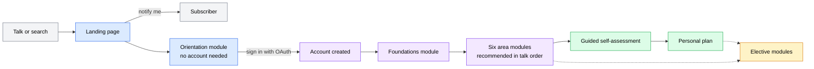
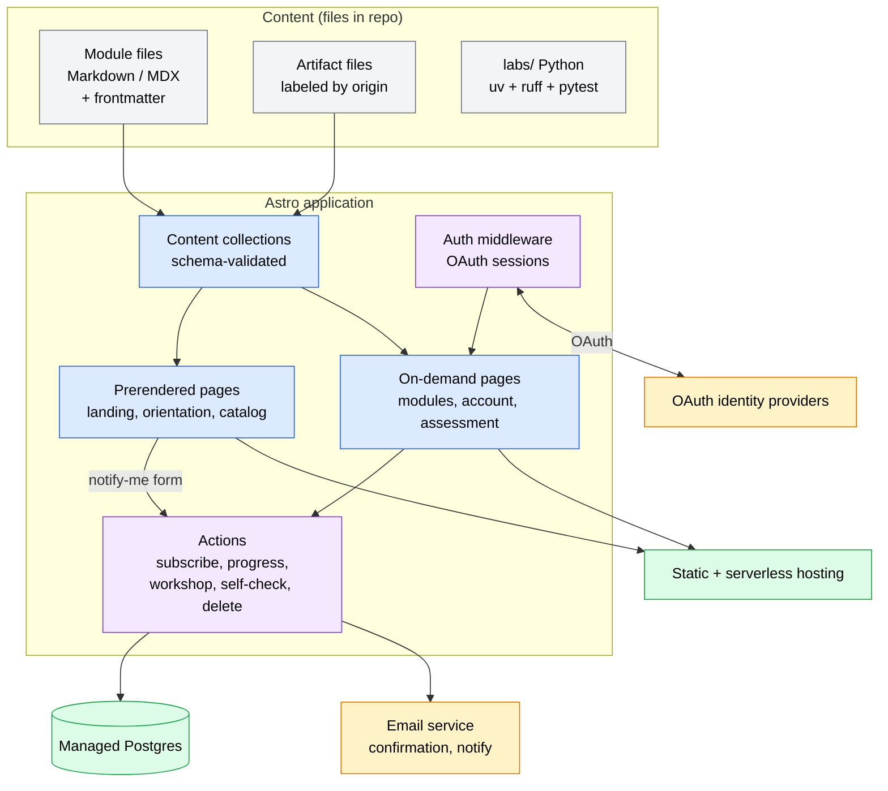
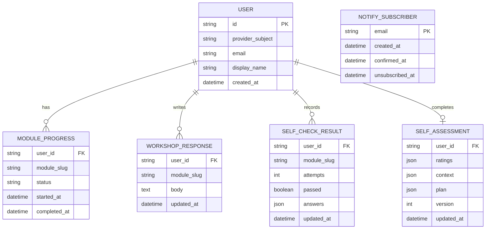

# becoming-an-ai-engineer PRD

**Version**: 1.0
**Author**: Stephen Sequenzia
**Date**: 2026-09-15
**Status**: Draft
**Spec Type**: New product
**Spec Depth**: Detailed specifications
**Description**: A self-paced online training program that follows the conference talk "Beyond the Coding Agent: From Software Engineer to AI Engineer." It gives experienced software engineers a much deeper, structured path through the six areas of AI engineering the talk maps, with modules, analysis exercises, optional code labs, and real-world examples. The book blueprint in `becoming-an-aie-book` supplies the depth, chapter template, and source material; the talk in `beyond-the-coding-agent` supplies the spine, vocabulary, pitfalls, and roadmap.

---

## 1. Executive Summary

The talk gives engineers a 35-minute conceptual map of what AI engineers actually engineer. This program is the follow-up resource: a self-paced site that takes each of the talk's six areas (Models, Context and knowledge, Tools and extensibility, Orchestration, Verification and evals, Operating it) to the depth of the book blueprint, using the book's chapter template for every module. The learner finishes with conceptual fluency across the six areas and a prioritized personal plan produced by a guided self-assessment. The site is built on Astro with OAuth accounts and per-learner progress, and it goes live as a landing page with a notify-me form on talk day, September 17, 2026.

## 2. Problem Statement

### 2.1 The Problem

Software engineers who want to move into AI engineering have two kinds of resource available: short conceptual overviews like the talk, and long reference works or research posts that assume the reader already knows where each topic fits. There is no structured path that starts from what an experienced engineer already does (decomposition, interface design, testing discipline, observability, security, operations) and shows precisely what each skill becomes when part of a system's behavior is delegated to a model.

The people who feel this most are engineers who have used a coding agent, have seen it do something impressive, and have not yet shipped a system whose behavior depends on a model. They know the tools as users. They do not yet know what the vendor engineered, or what they would own if it were their agent.

### 2.2 Current State

- **The talk** (`/Users/sequenzia/dev/beyond-the-coding-agent`) covers all six areas in 25 minutes with one pitfall per area, then spends 5 minutes on the transition: what transfers, what is new, the pitfalls, a four-step roadmap, and a resources slide. It is a map, not a course.
- **The book blueprint** (`/Users/sequenzia/dev/becoming-an-aie-book`) specifies 30 chapters across 8 parts, a fictional running application (Cedar Support Software), five build milestones, and a capstone rubric. It is an unauthored plan sized at roughly 500 pages with a heavy build track. No chapter prose, code, or labs exist.
- **The target repo** (`/Users/sequenzia/dev/becoming-an-aie`) holds a title README and nothing else.

### 2.3 Impact Analysis

Without a follow-up resource, the talk's audience leaves with a vocabulary and a roadmap slide and no next step that keeps the same framing. The book blueprint, as specified, would take far longer to author than a single part-time author can sustain, and its required build track excludes engineers who want fluency before committing to a project. The cost of not building this program is that the talk's framing does not persist beyond the room, and the book stays a blueprint.

### 2.4 Business Value

- Converts a one-time talk audience into a durable, linkable resource.
- Establishes the six-area framing and the "AI-enabled software engineer versus AI engineer" thesis as the reference point for this transition.
- Reuses the sourced research, diagrams, and pitfalls already produced for the talk, and the chapter designs already produced for the book, so most of the intellectual work is redistribution rather than invention.

## 3. Goals & Success Metrics

### 3.1 Primary Goals

1. Give an experienced software engineer conceptual fluency across the six areas of AI engineering, at a depth well beyond the talk, without requiring a build.
2. Produce, for each learner, a prioritized personal plan grounded in a per-area self-assessment against what transfers and what is new.
3. Become the resource people link to for the software-engineer-to-AI-engineer transition.

### 3.2 Success Metrics

| Metric | Current Baseline | Target | Measurement Method | Timeline |
|--------|------------------|--------|-------------------|----------|
| Module completion | None (no program) | Majority of learners who start a module complete it; a meaningful share finish all six area modules | Progress records in the application database | Reviewed quarterly after Phase 2 |
| Self-assessment completions | None | Learners who complete six area modules go on to complete the self-assessment | Progress records | Reviewed quarterly after Phase 3 |
| Qualitative feedback | None | Learner reports of moving into AI engineering work, or of teams adopting the material | Feedback form on the closing module, direct messages, conference follow-ups | Ongoing |
| Reference quality | None | Inbound links from engineering blogs and newsletters; returning visitors | Privacy-respecting page analytics (provider to be chosen, see Open Questions) | Reviewed quarterly |
| Notify-me conversion | None | Notify-me subscribers who create an account when modules launch | Subscriber and account records | At Phase 2 launch |

Targets are stated qualitatively because there is no baseline. Set numeric targets after the first quarter of Phase 2 data.

### 3.3 Non-Goals

- Certifying or credentialing learners.
- Running cohorts, live sessions, or a community.
- Teaching classical machine learning as a specialty. The foundations module covers what an application engineer needs and no more.
- Replacing the book blueprint. The blueprint remains the source for a future deep build track.

## 4. User Research

### 4.1 Target Users

#### Primary Persona: The experienced engineer without ML

- **Role/Description**: Several years shipping production software in any language. Has used a coding agent. Has not shipped a system whose behavior depends on a model. No ML or statistics background beyond an undergraduate course, if that.
- **Goals**: Understand what AI engineering actually consists of, judge which of their skills transfer, identify what they must add, and leave with a plan they believe.
- **Pain Points**: Overviews are too shallow; reference material assumes context they lack; most courses either teach prompting or teach model training, neither of which is the job.
- **Context**: Self-paced, evenings and weekends, on a laptop, in sessions of 30 to 60 minutes. May or may not have attended the talk.

#### Secondary Persona: The talk attendee

- **Role/Description**: Saw the talk, photographed the roadmap and resources slides, and wants the deeper version with the same vocabulary.
- **Goals**: Continue from the talk without re-learning the map.
- **Pain Points**: The resources slide is a reading list, not a path.
- **Context**: Arrives via the landing page URL or QR code from the talk.

#### Tertiary Persona: The engineer whose team is adopting agents

- **Role/Description**: Their organization is moving from a pilot to a customer-facing or enterprise deployment, and they have been made responsible for it.
- **Goals**: Learn what they now own before it breaks.
- **Pain Points**: Needs the "when it's your agent" perspective and the pitfalls more than the theory.
- **Context**: Reads the Operating and Verification modules first.

### 4.2 User Journey Map



A learner arrives from the talk or a search, reads the landing page, and can read the orientation module without an account. Signing in unlocks progress tracking, workshop responses, and self-checks. The recommended path is foundations, then the six area modules in the talk's order, then the guided self-assessment that produces the plan. Electives are available at any time after sign-in. Modules are not hard-gated; each states its prerequisites and the site shows the recommended order.

## 5. Functional Requirements

Priorities: P0 is required for the first full release (end of Phase 2). P1 is required for the complete program (end of Phase 3). P2 is planned but may follow.

### 5.1 Feature: Landing page with notify-me

**Priority**: P0 (live by September 17, 2026)

#### User Stories

**US-001**: As a talk attendee, I want a single page that restates the thesis and the six-area map and tells me what the program will cover, so that I can decide whether to follow it.

**US-002**: As a visitor, I want to leave my email and be told when modules launch, so that I do not have to check back.

**Acceptance Criteria**:
- [ ] The page states the two thesis sentences, shows the six-area map (the talk's landscape anatomy diagram, re-used with a text alternative), and lists the planned modules by name.
- [ ] The page states plainly that the program is free, self-paced, has no certificate, and does not require a build.
- [ ] The notify-me form accepts an email address, stores it with a created-at timestamp, and sends a confirmation email. The address is marked confirmed only after the recipient follows the confirmation link (confirmed opt-in).
- [ ] Every notification email carries an unsubscribe link that works without sign-in.
- [ ] A privacy notice is linked from the form and states what is stored, why, and how to have it deleted.
- [ ] The page is fully static except for the form submission, loads without JavaScript for reading, and meets the accessibility requirements in Section 6.4.
- [ ] The page is deployed on the final public domain so the URL or QR code placed on the talk's resources slide does not change later.

**Edge Cases**:
- Duplicate submission of a confirmed address: no second confirmation email; respond as if newly subscribed so the form does not reveal whether an address is on the list.
- Confirmation link used after unsubscribe: re-confirms the subscription and records the new confirmed-at time.
- Email service unavailable at submission: the address is stored as unconfirmed and the confirmation is retried; the visitor sees a success message either way.

---

### 5.2 Feature: Program structure and module catalog

**Priority**: P0

#### User Stories

**US-003**: As a learner, I want to see every module, its kind, its reading time, its prerequisites, and my status on it, so that I can choose where to go next.

**Acceptance Criteria**:
- [ ] The catalog lists modules grouped by kind: Orientation, Foundations, the six Area modules, Closing (self-assessment), and Electives.
- [ ] Each entry shows title, one-line summary, estimated reading time, prerequisites, and (when signed in) progress status: not started, in progress, complete.
- [ ] The six area modules appear in the talk's order: Models, Context and knowledge, Tools and extensibility, Orchestration, Verification and evals, Operating it.
- [ ] Modules are never hard-locked. A learner can open any module; the page shows unmet prerequisites as a notice.
- [ ] The catalog and module pages are generated from the content collection. Adding a module means adding a content file with valid frontmatter; no application code changes.

**Edge Cases**:
- A module file with invalid frontmatter fails the build, not the page render.
- A module marked `draft: true` is excluded from the catalog and from progress totals.

---

### 5.3 Feature: Orientation module

**Priority**: P0

#### User Stories

**US-004**: As a learner who did not attend the talk, I want the talk's framing delivered in reading form, so that the area modules make sense without it.

**US-005**: As a talk attendee, I want the orientation to be skimmable, so that I can move on quickly.

**Acceptance Criteria**:
- [ ] Readable without an account.
- [ ] Covers, in this order: the thesis (using AI versus engineering AI, and the definition of owner), why a compelling prototype is not evidence of production readiness, the six-area map with the anatomy diagram, what transfers (the six-row table), what is new (the seven competencies in priority order, and the prompt-to-context-to-harness ladder), the seven pitfalls, and the four-step roadmap.
- [ ] Draws on the talk's Section 1 and Section 3 outlines and on the book's Chapter 1 (responsibilities) and Chapter 2 (choosing a problem worth solving, summarized as "look before you build").
- [ ] Ends with a short self-check (Section 5.8) that is optional and does not count toward completion.
- [ ] Contains the same required body sections as an area module except the workshop and failure exercise, which are omitted for this kind.

**Edge Cases**:
- A signed-in learner who reads orientation gets it marked complete; an anonymous reader who later signs in does not, and can mark it complete manually.

---

### 5.4 Feature: Foundations module

**Priority**: P1

#### User Stories

**US-006**: As an engineer with no ML background, I want the minimum probability, machine learning, and foundation-model knowledge needed to reason about the six areas, so that the later modules do not lose me.

**Acceptance Criteria**:
- [ ] Scoped from the book's Part 2: experimental thinking and uncertainty (Chapter 4), what a model learns and why generalization is not training success (Chapter 5), and how foundation models work and fail: tokens, embeddings, attention at the level of intuition, decoding, and failure modes (Chapter 6).
- [ ] Every concept is introduced with the decision it affects later, and links forward to the area module where it is used (for example, sampling and paired comparison link to Verification and evals; context windows and position sensitivity link to Context and knowledge).
- [ ] Uses the full module template (Section 5.5). The workshop is an analysis exercise on provided artifacts: for example, comparing two classifier reports and identifying which comparison is misleading, or tracing a tokenization example.
- [ ] Contains no exercise that requires training a model. Training a small classifier is offered only as an optional code lab.
- [ ] Includes a short mathematical reference (notation for vectors, dot products, probability, expectation, precision, recall, F1, intervals) adapted from the book's appendix brief, placed as a collapsible section rather than a separate module.

**Edge Cases**:
- Learners with ML background can skip; the catalog marks the module as "recommended before Verification and evals" rather than required.

---

### 5.5 Feature: The six area modules and the module template

**Priority**: P0

This is the core of the program. Each area module follows the book's chapter template exactly, in this order, and the content build check (Section 6.5) fails if a required section is missing.

#### Module template

| Section | Required | Content |
|---|---|---|
| Header | Yes | Title, area, reading time, prerequisites, last updated and last checked dates |
| Transfer connection | Yes | What the reader already does, and what it becomes in this area. Expands the talk's "what transfers" row for this area |
| Topics and learning outcomes | Yes | The concepts, each with a stated outcome. This is where the coding-agent example (what you touched, what someone engineered) and the public incidents appear as worked examples |
| Workshop | Yes | A required analysis exercise on provided artifacts. No code. The learner writes a short response saved to their account |
| Failure exercise | Yes | A planted failure the learner diagnoses. Each area's failure exercise is built on that area's pitfall from the talk |
| Optional lab | No | A small standalone Python exercise (Section 5.7). Clearly marked optional |
| Completion evidence | Yes | The self-check (Section 5.8), plus the workshop response. Passing the self-check and submitting a workshop response marks the module complete |
| Sources | Yes | Sources with dates. Vendor facts and artifacts carry origin and checked-on labels (Section 5.6) |

#### Content map

| Module | Talk beats | Book chapters drawn on | Pitfall (drives the failure exercise) | Talk takeaway to preserve |
|---|---|---|---|---|
| Models | 2.1 | 6 (failure modes, summarized), 7 (structured outputs and application contracts), 10 (selecting models and system approaches) | A hardcoded model ID with no eval suite behind it | "The model is a versioned, expiring dependency. Treat it like one." |
| Context and knowledge | 2.2 | 11 (data engineering), 12 (retrieval and search), 13 (RAG and context construction), 14 (conversation state, memory, context lifecycles) | Adding context instead of curating it | "Context is a budget, not a bucket." |
| Tools and extensibility | 2.3 | 15 (designing tools for model callers) | Copying the API surface without evaluating task fit | "Design tools for a caller that reads the description every time and can still get it wrong." |
| Orchestration | 2.4 | 16 (reliable workflows), 17 (agent loops and harness engineering), 18 (long-running work and multiple agents) | Multi-agent before a workflow was tried | "The loop is where autonomy gets its limits. Start with the workflow." |
| Verification and evals | 2.5 | 8 (designing evaluation data), 9 (graders, experiments, error analysis), 19 (evaluating agents and verifying actions) | A generic judge instead of error analysis; grading the transcript instead of the outcome | "Check the action before accepting it. Measure behavior across representative cases. Keep both checks running as the system changes." |
| Operating it | 2.6 | 23 (security and trust boundaries), 24 (human interaction and responsible design), 25 (release engineering), 26 (observability and incident response), 27 (economics and optimization) | The lethal trifecta, assembled one integration at a time | "When you are the owner, its answer is your answer." |

The book's Chapter 3 (first measurable feature) becomes the optional lab for the Models module. Chapters 1 and 2 feed the orientation. Chapters 20 to 22 and 29 to 30 become electives (Section 5.10). Chapter 28 (capstone) is out of scope.

#### User Stories

**US-007**: As a learner, I want each area module to start from something I already do, so that the new material attaches to existing knowledge.

**US-008**: As a learner, I want to analyze real-looking artifacts rather than read about them, so that I build the model-behavior intuition the talk says only comes from reading outputs.

**US-009**: As a learner, I want to diagnose a planted failure per area, so that I recognize the pitfall when I meet it at work.

**Acceptance Criteria**:
- [ ] All six modules exist, follow the template order, and pass the content build check.
- [ ] Each module's transfer connection expands the corresponding row of the talk's "what transfers" table and names what stays the same and what changes.
- [ ] Each module's topics section includes at least one coding-agent worked example (what the user touched and what the vendor engineered for it) and at least one sourced public incident or first-hand account. Coding-agent examples are not limited to the two tools named in the talk, but any tool fact carries its checked-on date.
- [ ] Each workshop provides its artifacts inline or as downloadable files, states the analysis task in one paragraph, and gives a rubric the learner can apply to their own response. Responses are free text, saved per learner, and not graded.
- [ ] Each failure exercise plants the area's pitfall in an artifact, asks the learner to find and explain it, and reveals an explanation after the learner submits a response.
- [ ] Each module's self-check has between 6 and 12 questions with per-question feedback and covers every stated learning outcome at least once.
- [ ] Each module's reading time, excluding workshop and lab, is between 45 and 90 minutes.
- [ ] Each module's sources section lists every source with a date and links the talk beat and book chapters it draws on.
- [ ] Prose follows the talk repo's style: short declarative sentences and no em-dashes.

**Edge Cases**:
- A learner submits an empty workshop response: the module stays in progress and the form asks for at least a few sentences.
- A learner passes the self-check before writing the workshop response: completion waits for both.
- An artifact's checked-on date is older than the quarterly review window: the page shows a "may be out of date" notice next to it.

---

### 5.6 Feature: Exercise artifact library with origin labels

**Priority**: P0

#### User Stories

**US-010**: As a learner, I want to know whether an artifact is a real capture, an authored example, or a published case, so that I calibrate how much to generalize from it.

**US-011**: As the author, I want every artifact and vendor fact dated, so that a quarterly review can find what has gone stale.

**Acceptance Criteria**:
- [ ] Every artifact (trace, output set, tool schema, eval report, dashboard excerpt, incident writeup) carries exactly one origin label: `captured` (recorded from a real coding-agent or model session by the author), `synthetic` (authored for the exercise, with the failure planted deliberately), or `public` (published material, quoted or linked with attribution).
- [ ] Every artifact carries the tool or model name and version where applicable, and a checked-on date.
- [ ] Labels render visibly beside the artifact and are stored in module frontmatter so the build check can verify them.
- [ ] Captured artifacts come only from the author's own sessions on non-sensitive tasks and are reviewed for secrets, personal data, and third-party content before publication.
- [ ] Synthetic artifacts are realistic in format (for example, OpenTelemetry-style spans, tool schemas in the shape real agents use) and are never presented as measured results.
- [ ] Public artifacts are excerpted within fair use and link to the original.
- [ ] Vendor-specific facts in prose (a feature, a model ID, a pricing claim) carry a checked-on date in the sources section.

**Edge Cases**:
- A captured artifact's tool changes behavior: the artifact keeps its version label and date; the review pass decides whether to re-capture or replace with a synthetic version.
- An artifact is reused across modules: it is stored once and referenced by id; the label travels with it.

---

### 5.7 Feature: Optional code labs

**Priority**: P2

#### User Stories

**US-012**: As a learner who wants to go hands-on, I want a small, standalone Python exercise per module that runs against any model provider I have a key for, so that I can verify the concept without adopting a framework.

**Acceptance Criteria**:
- [ ] Each lab is a standalone directory under `labs/` with a `pyproject.toml`, managed with `uv`, formatted and linted with `ruff`, with type hints on all functions.
- [ ] Model access goes through a thin adapter: a single function that takes a task request and returns text, usage, timing, and model identity, with a typed failure. Provider-specific code lives only in the adapter.
- [ ] Each lab runs to completion in under ten minutes on a laptop and states its expected cost order of magnitude before any paid call.
- [ ] Each lab has a `pytest` test that exercises the non-model logic without an API key.
- [ ] Labs are marked optional everywhere they appear and never count toward module completion.
- [ ] Labs teach explicit model calls before any abstraction, consistent with the book's approach and the talk's "learn the loop before a framework."
- [ ] At minimum, labs exist for Models (the book's Chapter 3 first measurable feature), Tools (a tool contract with validation), and Verification and evals (reviewing 20 to 50 outputs and writing a first grader).

**Edge Cases**:
- No API key present: the lab explains what it would do and exits cleanly rather than failing with a stack trace.
- Provider returns an error mid-lab: the adapter's typed failure is shown and the lab suggests the retry.

---

### 5.8 Feature: Self-check component

**Priority**: P0

#### User Stories

**US-013**: As a learner, I want immediate feedback per question, so that a self-check teaches rather than just scores.

**Acceptance Criteria**:
- [ ] Questions are multiple choice with one or more correct options and a feedback paragraph per option.
- [ ] Feedback shows immediately after each answer; the learner may retry a question.
- [ ] The self-check is passed when every question has been answered correctly, allowing retries (mastery, not a percentage). Attempts and the final state are saved per learner.
- [ ] Fully keyboard operable: focus order follows reading order, options are reachable with Tab and selectable with Space or Enter, feedback is announced to assistive technology.
- [ ] Questions and answers live in the module's content file, not in application code.
- [ ] Anonymous readers can take the orientation self-check with results held only in the browser.

**Edge Cases**:
- Network failure on submit: the answer is kept locally and resubmitted; the learner sees a pending state, not an error.
- Content update changes a question after a learner passed: their pass stands; the module's checked-on date changes.

---

### 5.9 Feature: Accounts, progress, and data deletion

**Priority**: P0 (platform phase)

#### User Stories

**US-014**: As a learner, I want to sign in with an account I already have, so that my progress follows me across devices without a new password.

**US-015**: As a learner, I want to delete my account and everything stored about me, so that I control my data.

**Acceptance Criteria**:
- [ ] Sign-in is OAuth through a managed auth library. Identity providers are chosen at implementation (see Open Questions). No passwords are stored or handled by the application.
- [ ] Stored personal data is limited to: provider subject id, email, display name, and the learner's progress, workshop responses, self-check results, and self-assessment. Nothing else.
- [ ] Progress is recorded per module: started-at, completed-at, status.
- [ ] Workshop responses and self-assessment output are editable by the learner after submission.
- [ ] An account page shows all stored data in plain language and offers one-click deletion. Deletion removes all rows for the learner within the same request and signs them out. Notify-me subscriptions tied to the same email are removed too.
- [ ] The privacy notice covers accounts, progress data, the notify list, and deletion.
- [ ] Session handling, CSRF protection, and secure cookies are the auth library's defaults, not custom code.

**Edge Cases**:
- Same person signs in with two providers: two accounts. Merging is out of scope; the account page says so.
- Provider revokes access or the email changes: the account keeps the subject id; the learner can update the display name.
- Deletion requested while a request is in flight: the in-flight write fails closed.

---

### 5.10 Feature: Guided self-assessment and personal plan

**Priority**: P1

#### User Stories

**US-016**: As a learner who has finished the six areas, I want to rate myself per area and get a plan that says where to focus first, so that I leave with something I can act on Monday.

**Acceptance Criteria**:
- [ ] The closing module walks the learner through each of the six areas. For each area it presents the "what transfers" items and the "what is new" competencies relevant to that area, and asks for a self-rating on a four-point scale for each item (for example: not yet, aware, practiced, confident).
- [ ] The assessment also asks three context questions: the learner's current role, the AI feature they are closest to at work, and whether they own a model-dependent system today.
- [ ] The plan ranks areas by gap (lowest ratings on "what is new" items first), and for each of the top areas applies the talk's four-step roadmap to the learner's stated context: look before you build (review 20 to 50 outputs by hand), start constrained, own the harness, add autonomy as evals earn it.
- [ ] Each plan step links back to the module section that teaches it.
- [ ] The plan is saved to the account, editable, and exportable as Markdown.
- [ ] The module ends with an optional feedback form (free text) that feeds the qualitative success metric.
- [ ] Completing the assessment is possible without completing every area module, with a notice recommending the missing ones.

**Edge Cases**:
- Uniform high ratings: the plan says so and suggests the electives and the book blueprint's build track as next steps.
- Learner retakes later: the previous plan is kept as a dated version for comparison.

---

### 5.11 Feature: Elective modules

**Priority**: P2

#### User Stories

**US-017**: As a learner with a specific need, I want deep-dive modules beyond the six areas, so that I can specialize without those topics crowding the core path.

**Acceptance Criteria**:
- [ ] Electives use the full module template.
- [ ] Planned electives, from the book's Parts 6 and 8: Fine-tuning, distillation, and model adaptation (Chapter 20); Inference and hosting fundamentals (Chapter 21); Multimodal systems (Chapter 22); Working on an AI engineering team (Chapter 29); Building your career and continuing to learn (Chapter 30).
- [ ] Electives never appear as prerequisites for core modules.
- [ ] The order in which electives are authored is an open question (Section 12).

**Edge Cases**:
- An elective's workshop needs an experiment the learner cannot run (for example, fine-tuning): the workshop analyzes supplied reproducible experiment records instead, labeled by origin, as the book's Chapter 20 design proposes.

---

### 5.12 Feature: Content maintenance and drift review

**Priority**: P1

#### User Stories

**US-018**: As the author, I want a repeatable review that surfaces stale artifacts and vendor facts, so that the program stays trustworthy without a per-claim ledger.

**Acceptance Criteria**:
- [ ] A script lists every artifact and dated source whose checked-on date is older than 90 days, grouped by module.
- [ ] The quarterly review updates dates, replaces or re-captures stale artifacts, and records what changed in a changelog page visible to learners.
- [ ] Module pages show last-updated and last-checked dates in the header.
- [ ] A build warning (not failure) is emitted for any date older than 180 days.

**Edge Cases**:
- A public source disappears: the artifact keeps its quote and gains an "archived on" note with an archive link.

## 6. Non-Functional Requirements

### 6.1 Performance

- Landing, orientation, and catalog pages are statically generated and ship no JavaScript beyond what the self-check needs.
- Signed-in module pages render on demand; target under 500 ms server time at the expected scale.
- Self-check interactions respond locally; persistence is asynchronous.
- Images and diagrams are served as optimized SVG or WebP with explicit dimensions.

### 6.2 Security

- OAuth only; no password storage; auth library defaults for sessions and CSRF.
- Data minimization as specified in Section 5.9. No analytics identifiers tied to accounts.
- All learner-submitted text (workshop responses, plan edits) is rendered as plain text, never as HTML or Markdown, to avoid stored injection.
- Secrets (database URL, OAuth client secrets, email API key) live in the host's environment configuration and never in the repository.
- The notify-me and workshop actions are rate limited per IP and per account.

### 6.3 Scalability

- Expected load is hundreds to low thousands of learners, with spikes after the talk and after any newsletter mention.
- The free hosting tier and a small managed Postgres instance are sufficient; nothing in the design assumes more than one server process.

### 6.4 Accessibility

- WCAG 2.1 AA across the site.
- One `h1` per page and a strict heading hierarchy matching the module template.
- Text alternatives for the anatomy diagram and every mini-map variant; long descriptions for diagrams that carry meaning.
- Self-checks, progress controls, and forms fully keyboard operable with visible focus.
- Verified color contrast; if the talk's dark palette is adopted, contrast is checked per the design brief's color roles.
- Reduced-motion preference respected; no content depends on animation.

### 6.5 Content quality and testing

- **Content build check**: the build fails if any non-draft module lacks a required template section, has frontmatter that fails the schema, references an artifact without an origin label or checked-on date, or has a self-check with fewer than six questions (area and foundations modules).
- **Application tests**: automated tests for every Action (notify-me subscribe and confirm, progress update, workshop save, self-check result, self-assessment save, account deletion) and for the auth guard on signed-in routes.
- **Accessibility check**: an automated audit runs on the landing page, one module page, and the self-check component in CI, and a manual keyboard pass is part of the Phase 1 and Phase 2 gates.

### 6.6 Privacy

- Privacy notice published before the notify-me form goes live.
- Confirmed opt-in for the notify list; unsubscribe in every email.
- Self-service deletion covering all learner data.
- No third-party trackers. Page analytics, if adopted, are cookieless and aggregate only.

## 7. Technical Considerations

### 7.1 Architecture Overview

The site is a content-first Astro application. Module content lives in typed content collections as Markdown or MDX files. Public pages are prerendered. Signed-in module pages, the account page, and the self-assessment render on demand. All writes (notify-me, progress, workshop responses, self-check results, self-assessment, deletion) are Astro Actions with schema-validated input. Authentication is a managed auth library with OAuth providers. Persistence is a managed Postgres database accessed through a typed query builder. Optional code labs are a separate `labs/` tree in the same repository, in Python, with no dependency on the site.



### 7.2 Tech Stack

- **Framework**: Astro 7 in server output mode with an adapter for the host. Content collections for modules and artifacts. Astro Actions for all writes. Islands only for the self-check and the self-assessment.
- **Content**: Markdown and MDX with a Zod frontmatter schema. Decide before authoring whether the unified (remark and rehype) plugin ecosystem is needed; Astro 7's default Markdown pipeline does not run those plugins and requires `@astrojs/markdown-remark` to be reinstalled if they are.
- **Auth**: Better Auth with its Astro integration. OAuth providers to be chosen.
- **Database**: Neon Postgres accessed through Drizzle. Standard Postgres keeps the data portable.
- **Hosting**: Netlify on its Node runtime and free tier.
- **Email**: a transactional email provider called from an Action for confirmation and notification messages (provider to be chosen; see Open Questions).
- **Code labs**: Python managed with `uv`, formatted and linted with `ruff`, tested with `pytest`, type hints throughout.
- **Diagrams**: the talk's SVG anatomy diagram and mini-map variants, regenerated from the talk repo's `internal/build-diagrams.mjs` if the base changes.

The stack was selected by a research pass on September 15, 2026 comparing Astro, Next.js, and FastAPI with HTMX against the "best long-term" criterion. Re-verify library versions and integration status with Context7 before implementation begins.

### 7.3 Content model

Frontmatter schema for a module (illustrative; the Zod schema is the source of truth):

```yaml
title: Verification and evals
slug: verification-and-evals
kind: area            # orientation | foundations | area | closing | elective
area: evals           # models | context | tools | orchestration | evals | operating | none
order: 5
summary: One sentence.
readingMinutes: 75
prerequisites: [foundations, models]
talkBeats: ["2.5"]
bookChapters: [8, 9, 19]
draft: false
updatedOn: 2026-10-01
checkedOn: 2026-10-01
artifacts:
  - id: evals-20-outputs
    origin: synthetic   # captured | synthetic | public
    tool: none
    checkedOn: 2026-10-01
sources:
  - title: Demystifying evals for AI agents
    org: Anthropic
    date: 2026-01
    url: https://www.anthropic.com/engineering/demystifying-evals-for-ai-agents
selfCheck:
  - question: ...
    options: [...]
    correct: [1]
    feedback: [...]
```

Required body sections, detected by heading text, for `kind: area`, `foundations`, and `elective`: Transfer connection; Topics and learning outcomes; Workshop; Failure exercise; Completion evidence; Sources. Optional lab is permitted between Failure exercise and Completion evidence. Orientation omits Workshop and Failure exercise. Closing has its own structure.

### 7.4 Progress data



`NOTIFY_SUBSCRIBER` is independent of `USER`; deletion of a user also removes any subscriber row with the same email.

### 7.5 Integration Points

| System | Integration Type | Purpose |
|--------|-----------------|---------|
| OAuth identity providers | OAuth 2.0 via the auth library | Sign-in without passwords |
| Neon Postgres | Database connection from Actions | Progress, responses, assessments, subscribers |
| Netlify | Build and deploy from the repository | Hosting, environment configuration, CI checks |
| Transactional email provider | HTTPS API from Actions | Confirmation and launch notification emails |
| Talk repository | File reuse | Anatomy diagram SVGs, six-area content, pitfalls, roadmap, research notes |
| Book blueprint repository | File reuse | Chapter briefs, workshop and failure-exercise designs, appendix briefs, source ledger |
| Model providers (labs only) | HTTPS API behind the lab adapter | Optional code labs |

### 7.6 Technical Constraints

- Astro 7 removed `@astrojs/db`; use Drizzle directly.
- Astro 7's Markdown pipeline replaced remark and rehype; the compiler is stricter about unclosed tags. Decide the Markdown toolchain before authoring the first module.
- Astro ships roughly one major version per year with a two-year maintenance window. Budget one upgrade per year.
- Keep marketing and orientation pages prerendered; render module pages on demand rather than using server islands, to keep cache behavior simple.
- The hosting runtime must be Node, not an edge isolate, so that the auth and database libraries work without constraint.
- Learner-submitted text is stored and rendered as plain text only.
- No new dependency is added without the author's explicit approval.

## 8. Scope Definition

### 8.1 In Scope

- Landing page with confirmed opt-in notify-me, live by September 17, 2026.
- Astro application with OAuth accounts, progress tracking, workshop responses, self-checks, self-assessment, and account deletion.
- Orientation module, foundations module, six area modules, closing self-assessment module.
- Exercise artifact library with origin, version, and date labels.
- Optional standalone Python code labs for at least three modules.
- Five elective modules from the book's Parts 6 and 8.
- Content build check, application tests, accessibility audit, quarterly drift review.
- Reuse of the talk's diagrams and content and the book's chapter designs.

### 8.2 Out of Scope

- **Certificates or credentials**: the program does not promise a title or a job outcome, consistent with the book blueprint's standard.
- **Community or discussion features**: no forums, comments, or chat.
- **Payments or paid tiers**: free throughout, no gated content.
- **A full build track**: no running application carried across modules like the book's Cedar Support; the capstone (Chapter 28) is not adapted.
- **A formal per-claim sourcing ledger**: sources are cited and dated; there are no verification markers or a do-not-use list.
- **Cohorts or live sessions**.
- **Account merging across identity providers**.
- **Native mobile applications**; the site is responsive.

### 8.3 Future Considerations

- A build track that follows the book blueprint's Cedar Support application, offered as a separate program that links from the plan.
- Instructor or team mode: a manager sees aggregate progress for consenting team members.
- Localization.
- A downloadable or printable edition of the core modules.

## 9. Implementation Plan

### 9.1 Phase 0: Landing page, live by talk day

**Completion Criteria**: The landing page is live on the final domain with a working confirmed opt-in form and a published privacy notice, and its URL or QR code is placed on the talk's resources slide.

| Deliverable | Description | Dependencies |
|-------------|-------------|--------------|
| Repository scaffold | Astro 7 project, Netlify deploy, environment configuration | Domain, Netlify account |
| Landing page | Thesis, six-area map with text alternative, module list, scope statement | Talk diagram assets |
| Notify-me Action | Store address, send confirmation, confirm and unsubscribe links | Neon database, email provider |
| Privacy notice | Covers the notify list now and accounts later | None |
| Resources slide update | URL or QR code on slide 24 (an open item in the talk repo) | Final domain |

**Checkpoint Gate**: Privacy notice reviewed and the confirmation flow exercised end to end with a real inbox before the form goes live.

---

### 9.2 Phase 1: Platform, against a fixed checklist

**Completion Criteria**: Every item on the platform-done checklist below is complete and tested, and the orientation module renders end to end through the real content pipeline. Nothing not on the checklist is built in this phase.

Platform-done checklist:

1. OAuth sign-in and sign-out through the auth library; auth guard on signed-in routes.
2. Content collections with the module and artifact schemas from Section 7.3.
3. Module page layout rendering the template sections, header dates, artifact labels, and prerequisite notices.
4. Catalog page with progress status.
5. Progress, workshop, and self-check Actions with tests.
6. Self-check island meeting Section 5.8 and the keyboard requirements.
7. Account page with data view and one-click deletion, with tests.
8. Content build check per Section 6.5.
9. Accessibility audit in CI.

| Deliverable | Description | Dependencies |
|-------------|-------------|--------------|
| Auth | Managed OAuth integration, session middleware, guard | Identity provider choice |
| Schemas and layouts | Collections, module layout, catalog | Markdown toolchain decision |
| Actions and tests | All writes, rate limits, tests | Database |
| Self-check island | Accessible component reading questions from frontmatter | None |
| Account and deletion | Data view, deletion, subscriber cleanup | Auth, database |
| Content check | Build-time validation of template sections, labels, dates | Schemas |
| Orientation module | First real module through the pipeline (content from Phase 2 may start here) | Talk Sections 1 and 3 |

**Checkpoint Gate**: Architecture and auth review before any learner data is accepted; manual keyboard and screen-reader pass on the self-check and account pages; confirmation that the checklist is closed and the phase ends.

---

### 9.3 Phase 2: Core content

**Completion Criteria**: Orientation, foundations, and all six area modules are published, pass the content build check, carry labeled artifacts, and one representative learner has reviewed the first area module before the remaining five were finalized.

| Deliverable | Description | Dependencies |
|-------------|-------------|--------------|
| Orientation module | Per Section 5.3 | Phase 1 |
| Models module | First area module; includes the Chapter 3 optional lab if time allows | Artifact capture for Models |
| Learner review | A representative engineer reads Models end to end and reports friction | Models module |
| Foundations module | Per Section 5.4 | Learner review findings |
| Remaining five area modules | Context, Tools, Orchestration, Evals, Operating, in talk order | Learner review findings, artifacts |
| Artifact library | All artifacts for the eight modules, labeled and reviewed | Capture sessions, synthetic authoring |
| Launch notification | Email to confirmed subscribers when the six areas are live | Notify list |

**Checkpoint Gate**: After the Models module, a content review with the representative learner decides whether the template, reading length, and workshop format hold before the remaining modules are written. Before launch notification, an accessibility pass on one module page and the catalog.

---

### 9.4 Phase 3: Closing content

**Completion Criteria**: The guided self-assessment produces and saves a plan; at least three optional labs exist; at least the first two electives are published.

| Deliverable | Description | Dependencies |
|-------------|-------------|--------------|
| Self-assessment module | Ratings, context questions, plan generation, export, feedback form | Six area modules |
| Optional labs | Models, Tools, Verification and evals | Lab adapter |
| Electives | Order to be decided (Open Questions) | Module template |
| Drift review script | Lists stale dates by module | Frontmatter dates |

**Checkpoint Gate**: Plan output reviewed against the talk's four-step roadmap for fidelity before the module is published.

---

### 9.5 Phase 4: Operate and polish

**Completion Criteria**: The first quarterly review has run and its changes are recorded on the changelog page; success metrics have a first reading and numeric targets are set.

| Deliverable | Description | Dependencies |
|-------------|-------------|--------------|
| Quarterly review | Refresh stale artifacts and facts; changelog entry | Drift review script |
| Metrics reading | Completion, self-assessment, feedback, reference signals | Phase 2 and 3 data |
| Remaining electives | Publish the rest | Phase 3 |
| Performance and accessibility pass | Full-site audit | Phase 3 |

## 10. Dependencies

### 10.1 Technical Dependencies

| Dependency | Owner | Status | Risk if Delayed |
|------------|-------|--------|-----------------|
| Final domain | Stephen Sequenzia | Not started | Slide 24 URL cannot be fixed; Phase 0 slips |
| Netlify account and deploy | Stephen Sequenzia | Not started | Phase 0 slips |
| Neon database | Stephen Sequenzia | Not started | Notify-me cannot store addresses |
| Transactional email provider | Stephen Sequenzia | Not chosen | Confirmed opt-in cannot be completed |
| OAuth identity providers | Stephen Sequenzia | Not chosen | Phase 1 auth blocked |
| Talk diagram assets | Talk repo (`internal/`) | Available | None |
| Book chapter briefs | Book repo (`chapters.json`, `book-outline.md`) | Available | None |
| Markdown toolchain decision | Stephen Sequenzia | Not decided | Authoring blocked until decided |

### 10.2 Cross-Team Dependencies

| Team | Dependency | Status |
|------|------------|--------|
| Representative learner (one engineer matching the primary persona) | Review the Models module before the remaining modules are written | Not identified |

## 11. Risks & Mitigations

| Risk | Impact | Likelihood | Mitigation Strategy | Owner |
|------|--------|------------|--------------------|-------|
| Platform work consumes the time meant for content | High | High | Fixed platform-done checklist ends Phase 1; content is files that render without app changes; first-party Astro features minimize custom code | Stephen Sequenzia |
| Author bandwidth stalls the program after the first modules | High | High | Module template plus build check reduce per-module decisions; Models module reviewed before the rest; electives and labs deferred to Phase 3 and 4 | Stephen Sequenzia |
| Tool and model drift makes artifacts and facts stale | Medium | High | Origin, version, and checked-on labels; quarterly review; prefer synthetic artifacts where a specific failure must be planted | Stephen Sequenzia |
| Astro major-version churn | Medium | Medium | Stay within the maintenance window; budget one upgrade per year; pin versions | Stephen Sequenzia |
| Captured artifacts leak secrets or third-party content | Medium | Low | Capture only from the author's own non-sensitive sessions; review before publishing | Stephen Sequenzia |
| Learners expect a build track and leave | Medium | Medium | Scope stated on the landing page and orientation; optional labs; link to the book blueprint for the deep track | Stephen Sequenzia |
| Landing page not ready by September 17 | Medium | Medium | Phase 0 is one static page and one form; fallback is publishing the talk's resources list at the same URL | Stephen Sequenzia |
| Notify list deliverability or spam complaints | Low | Low | Confirmed opt-in, unsubscribe in every email, few sends | Stephen Sequenzia |

## 12. Open Questions

| # | Question | Owner | Due Date | Resolution |
|---|----------|-------|----------|------------|
| 1 | Which OAuth identity providers to enable | Stephen Sequenzia | Before Phase 1 | |
| 2 | Final domain, and whether slide 24 gets a QR code or a short URL | Stephen Sequenzia | 2026-09-16 | |
| 3 | Which transactional email provider to use for confirmation and notification (research suggested Resend or Kit) | Stephen Sequenzia | 2026-09-16 | |
| 4 | Whether the talk's dark palette and design brief carry over to the site | Stephen Sequenzia | Before Phase 1 | |
| 5 | Markdown toolchain: Astro 7 default pipeline, or reinstall the remark and rehype pipeline for plugins | Stephen Sequenzia | Before the first module is authored | |
| 6 | Which elective modules to author first | Stephen Sequenzia | Phase 3 start | |
| 7 | Who serves as the representative learner for the Models module review | Stephen Sequenzia | Phase 2 start | |
| 8 | Whether to adopt cookieless page analytics, and which provider | Stephen Sequenzia | Phase 2 | |

## 13. Appendix

### 13.1 Assumptions made in this spec

These were inferred to fill gaps and should be confirmed or corrected:

- Workshop responses are free text saved to the account and not graded; completion requires a response of any length beyond a few sentences plus a passed self-check.
- Self-checks use mastery (every question eventually correct, retries allowed) rather than a percentage score.
- Modules are not hard-gated; prerequisites are advisory and the catalog shows the recommended order.
- Each area's failure exercise is built on that area's pitfall from the talk. This keeps the talk's pitfalls central without adding a section to the book's template.
- The self-assessment uses a four-point scale and ranks areas by gap on "what is new" competencies.
- Optional labs exist for Models, Tools, and Verification and evals first, because those are where a small code exercise adds the most.
- Reading time per area module is 45 to 90 minutes excluding workshop and lab.
- The quarterly review window is 90 days, with a warning at 180.

### 13.2 Glossary

| Term | Definition |
|------|------------|
| AI-enabled software engineer | An engineer who uses AI tools to build software whose behavior does not depend on a model |
| AI engineer | An engineer who builds and is responsible for systems whose behavior depends on a foundation model |
| Owner | The engineer or team accountable for a delivered product's behavior and operating limits |
| Harness | Everything around the model that the engineer builds: prompts, context construction, tools, control flow, checks |
| Workflow | LLM calls and tools orchestrated through predefined code paths |
| Agent | A system in which the model dynamically directs its own process and tool use |
| Eval | A check of behavior across a distribution of cases against graders, reporting a rate, as opposed to a deterministic test of one path |
| Lethal trifecta | Private data access, exposure to untrusted content, and a channel for external communication, present together in one system |
| Context engineering | Curating what enters the model's context window as a budgeted resource |
| Harness engineering | Designing the loop, control flow, and verification around the model |
| Artifact origin | One of `captured`, `synthetic`, or `public`, stating where an exercise artifact came from |
| Module kind | One of orientation, foundations, area, closing, elective |

### 13.3 References

Source repositories:

- Talk: `/Users/sequenzia/dev/beyond-the-coding-agent`. Current outline `outlines/outline-v2.md`; slides `slides/section-1` to `section-3`; research `research/section-1.md` to `section-3.md`; diagrams `internal/`; design brief `style/design-brief.md`.
- Book blueprint: `/Users/sequenzia/dev/becoming-an-aie-book`. Chapters `chapters.json` and `book-outline.md`; assessment design `project-and-assessment.md`; research `research/report-source.md` and `research/sources.json`.

Content sources carried over from the talk's resources slide and research files:

- Chip Huyen, *AI Engineering: Building Applications with Foundation Models*, O'Reilly, 2025.
- Anthropic engineering: "Building effective agents" (December 2024); "Effective context engineering for AI agents" (September 2025); "Demystifying evals for AI agents" (January 2026); "Multi-agent research system"; "Effective harnesses for long-running agents".
- OpenAI, "A practical guide to building agents" (2025).
- Hamel Husain, "AI Evals: Everything You Need to Know," hamel.dev. Shreya Shankar and Hamel Husain, *Evals for AI Engineers*, O'Reilly, October 2026.
- OWASP Top 10 for LLM Applications (2025) and for Agentic Applications (2026).
- OpenTelemetry GenAI semantic conventions.
- Gergely Orosz, "AI Engineering in the real world," The Pragmatic Engineer, March 2025.
- Mitchell Hashimoto, "My AI Adoption Journey," February 2026.
- Andrej Karpathy, "Software Is Changing (Again)," June 2025.
- Shankar et al., "Who Validates the Validators?", UIST 2024 (criteria drift).
- Simon Willison on the lethal trifecta and prompt injection.

Stack research sources (research pass on September 15, 2026; re-verify at implementation):

- Astro 7.0 release, June 22, 2026: https://astro.build/blog/astro-7/
- Astro v7 upgrade guide: https://docs.astro.build/en/guides/upgrade-to/v7/
- Astro content collections: https://docs.astro.build/en/guides/content-collections.html
- Astro Actions: https://docs.astro.build/en/guides/actions/
- InfoQ coverage of Astro's Rust Markdown pipeline, August 2026: https://www.infoq.com/news/2026/08/astro-satteri-rust/
- Better Auth Astro integration: https://www.better-auth.com/docs/integrations/astro
- Vercel acquires Better Auth, July 7, 2026: https://vercel.com/blog/vercel-acquires-better-auth
- Next.js 16 upgrade guide: https://nextjs.org/docs/app/guides/upgrading/version-16
- Report of silent breaking changes in Next.js 16: https://www.squaredtech.co/nextjs-16-upgrade-broke-4-things-no-errors-no-warnings
- fastapi-users repository (maintenance mode as of 2026): https://github.com/fastapi-users/fastapi-users
- Neon vs Supabase vs Turso comparison, 2026: https://www.pkgpulse.com/guides/neon-vs-supabase-vs-turso-2026
- Astro hosting price comparison, 2026: https://instapods.com/blog/astro-hosting/

Research claims to re-verify before relying on them: Better Auth's ownership and license status after the Vercel acquisition; Auth.js maintenance status; Turso pricing and scale-to-zero changes; the Next.js 16 breaking-change behavior; fastapi-users maintenance status.

---

*Document generated by SDD Tools*
